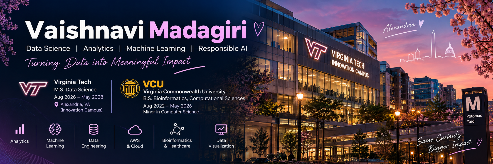

  

# Hi, I'm Vaishnavi 👋

### Data Science M.S. Student @ Virginia Tech | Bioinformatics Graduate @ VCU

I'm a data science graduate student interested in turning messy data into useful analysis, models, dashboards, and data products.

My projects span **data analytics, SQL, machine learning, bioinformatics, data engineering, and responsible AI**, with a focus on building complete workflows instead of just isolated notebooks.

I'm currently seeking **data science, data analytics, machine learning, and data engineering internship and early-career opportunities**.

---

## ⭐ Featured Projects

### 💳 [Customer Spending Analytics Dashboard](https://github.com/vmadagiri/customer-spending-analytics-dashboard)

End-to-end retail analytics project built around **50,000+ synthetic transactions**.

- Designed a normalized **PostgreSQL** database containing customers, products, stores, and transactions
- Wrote **26 SQL business queries** using joins, CTEs, window functions, ranking, RFM segmentation, cohort analysis, and churn-risk logic
- Built reusable Python data workflows with **pandas and SQLAlchemy**
- Developed an interactive **Streamlit + Plotly** dashboard with KPI tracking, customer analysis, product performance, regional trends, and business recommendations
- Created a Quarto portfolio case study to communicate technical work to non-technical stakeholders

**Tech:** Python • SQL • PostgreSQL • pandas • SQLAlchemy • Streamlit • Plotly • Quarto

---

### 🤖 [Responsible AI Customer Support Platform](https://github.com/vmadagiri/customer-spending-analytics-ai-support)

Built an LLM-powered customer support workflow focused on what happens **before and after the model call**, including privacy, evaluation, guardrails, and human oversight.

- Integrated the **OpenAI Responses API** into a Python application
- Built PII masking to reduce exposure of names, emails, phone numbers, and payment information before model calls
- Added controls for unsupported actions, sensitive-information requests, and prompt-injection attempts
- Created rule-based evaluation logic and investigated false positives in the evaluator itself
- Evaluated real model outputs across representative support scenarios
- Added automated testing with **pytest** for masking, prompting, evaluation, and integration logic
- Designed human-review checkpoints for higher-risk cases

**Tech:** Python • OpenAI API • pandas • Streamlit • pytest • LLM Evaluation • Responsible AI

---

### 🧬 [RNA-seq DCM Gene Expression Analysis](https://github.com/vmadagiri/RNAseq-DCM-GeneExpression-Analysis)

Analyzed public RNA-seq data to investigate gene-expression differences in **dilated cardiomyopathy (DCM)** and explore sex-specific effects.

- Analyzed the public **GSE141910** heart-tissue dataset with **305 samples**
- Performed filtering, transformations, PCA, UMAP, and differential gene-expression analysis
- Investigated expression differences between DCM and non-failing hearts
- Compared male and female DCM samples
- Performed **KEGG pathway enrichment analysis**
- Created PCA, UMAP, volcano, distribution, and pathway visualizations
- Documented results, biological interpretation, and analytical limitations

**Tech:** R • GEOquery • limma • clusterProfiler • UMAP • data.table

---

## 💻 Technical Skills

### Languages
**Python • SQL • R • Java**

### Data Science & Machine Learning
**pandas • NumPy • scikit-learn • Exploratory Data Analysis • Statistical Analysis • Machine Learning • Feature Engineering**

### Data Visualization
**Plotly • Matplotlib • Streamlit • Quarto**

### Databases & Data Engineering
**PostgreSQL • SQL Server • SQLAlchemy • ETL Pipelines • Relational Data Modeling**

### AI & LLMs
**OpenAI API • Prompt Design • LLM Evaluation • PII Masking • Guardrails • Human-in-the-Loop Workflows**

### Tools & Cloud
**Git • GitHub • Jupyter Notebook • VS Code • AWS**

---

## 🎓 Education

### Virginia Tech
**M.S. Data Science**

### Virginia Commonwealth University
**B.S. Bioinformatics, Computational Sciences**  
Minor in Computer Science

---

## 🏆 Certifications

☁️ **AWS Certified Cloud Practitioner**

📊 **IBM Data Science Professional Certificate**

🐍 **PCPP1 — Certified Professional in Python Programming**

---

## 🌱 What I'm Working On

- Building portfolio projects with real-world public datasets
- Strengthening machine learning model development and evaluation
- Developing reproducible ETL and data-engineering workflows
- Expanding my AWS and cloud data skills
- Exploring responsible and production-minded applications of AI

---

## 📫 Let's Connect

I'm always interested in connecting with people working in **data science, analytics, machine learning, AI, and data engineering**.

💼 [LinkedIn](https://www.linkedin.com/in/vaishnavi-madagiri-b0a08b265)  
📧 [Email](mailto:Vaishnavi.madagiri@gmail.com)

